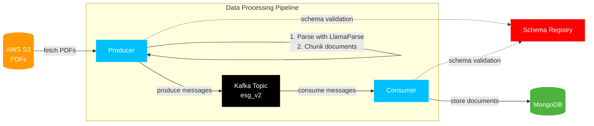

# Document Embedding Pipeline (using Confluent Cloud)

This project implements a scalable document processing pipeline using AWS S3, Apache Kafka (Confluent Cloud), MongoDB, and LlamaParse.

## Architecture



## Features

- PDF document processing from S3 bucket
- Intelligent document parsing with LlamaParse
- Document chunking for better processing
- Avro serialization/deserialization with Schema Registry
- Scalable message processing with Kafka
- Persistent storage in MongoDB
- Multi-threaded consumer implementation

## Prerequisites

- Python 3.9+
- AWS Account with S3 access
- Confluent Cloud account
- MongoDB instance
- LlamaParse API key

## Environment Setup

1. Create a `.env` file with the following variables:

```env
# AWS Configuration
AWS_ACCESS_KEY_ID=your_aws_access_key
AWS_SECRET_ACCESS_KEY=your_aws_secret_key
AWS_SESSION_TOKEN=your_session_token
S3_BUCKET_NAME=your_bucket_name
S3_PREFIX=your_prefix

# MongoDB Configuration
MONGODB_URI=your_mongodb_uri
MONGODB_DB=your_database_name
MONGODB_COLLECTION=your_collection_name

# LlamaParse Configuration
LLAMA_PARSE_API_KEY=your_llamaparse_api_key

# Confluent Cloud Configuration
SCHEMA_REGISTRY_URL=https://your-sr-endpoint.confluent.cloud
SCHEMA_REGISTRY_API_KEY=your_schema_registry_api_key
SCHEMA_REGISTRY_API_SECRET=your_schema_registry_api_secret
```

2. Create a `client.properties` file with your Confluent Cloud configuration:

```properties
bootstrap.servers=your-kafka-broker
security.protocol=SASL_SSL
sasl.mechanisms=PLAIN
sasl.username=your_api_key
sasl.password=your_api_secret
```

## Installation

1. Clone the repository:
```bash
git clone https://github.com/mongodb-partners/doc-embedding-stream.git
cd doc-embedding-stream
```

2. Create and activate a virtual environment:
```bash
python -m venv doc-embedding-stream
source doc-embedding-stream/bin/activate  # On Windows: doc-embedding-stream\Scripts\activate
```

3. Install dependencies:
```bash
pip install -r requirements.txt
```

## Data Flow

1. **Document Ingestion**
   - PDFs are stored in AWS S3
   - Producer reads PDFs from specified S3 bucket/prefix
   - Documents are parsed using LlamaParse

2. **Document Processing**
   - Each PDF is split into pages
   - Pages are processed as individual chunks
   - Metadata is preserved for each chunk

3. **Message Production**
   - Chunks are serialized using Avro
   - Messages are produced to Kafka topic
   - Schema Registry ensures message compatibility

4. **Message Consumption**
   - Consumer reads messages from Kafka
   - Messages are deserialized using Avro schema
   - Processed data is stored in MongoDB

## Schema

The Avro schema for messages:

```json
{
  "type": "record",
  "name": "summary_embedding_v2_value",
  "namespace": "org.apache.flink.avro.generated.record",
  "fields": [
    {
      "name": "content",
      "type": ["null", "string"],
      "default": null
    },
    {
      "name": "embeddings",
      "type": ["null", {"type": "array", "items": ["null", "float"]}],
      "default": null
    }
  ]
}
```

## Usage

Run the application:
```bash
python client.py
```

The application will:
1. Start a consumer thread for processing messages
2. List PDF files from S3
3. Process and chunk each PDF
4. Send chunks to Kafka
5. Consumer will process messages and store them in MongoDB

## Confluent Setup and Flink SQL

### Confluent Cloud Setup

1. **Create a Confluent Cloud Account**
   - Go to [Confluent Cloud](https://confluent.cloud/)
   - Sign up for a new account or log in
   - Create a new environment and cluster

2. **Create Required Topics**
   ```bash
   # Create the source topic for raw data
   confluent kafka topic create raw_v1 --partitions 6

   # Create the destination topic for embeddings
   confluent kafka topic create summary_embedding_v2 --partitions 6
   ```

4. **Create and Run Flink SQL Statements**
   ```sql
   -- Create the embedding model
   CREATE MODEL AWSBedrockEmbedding INPUT (text STRING) OUTPUT (embeddings ARRAY<FLOAT>)
   WITH (
       'bedrock.connection' = 'bedrock-connection-0',
       'task' = 'embedding',
       'provider' = 'BEDROCK'
   );

   -- Create the destination table
   CREATE TABLE summary_embedding_v2 (
       content STRING,
       embeddings ARRAY<FLOAT>
   );

   -- Insert transformed data
   INSERT INTO summary_embedding_v2
   SELECT
       CAST(val as STRING),
       embeddings
   FROM
       raw_v1,
       LATERAL TABLE (ML_PREDICT('AWSBedrockEmbedding', CAST(val as STRING)));
   ```

5. **Configure AWS Bedrock Connection**
   - In Confluent Cloud, go to Data Integration → Connections
   - Click "Add Connection" and select AWS Bedrock
   - Configure with your AWS credentials
   - Name the connection 'bedrock-connection-0'

6. **Deploy the Pipeline**
   - Review the pipeline configuration
   - Click "Deploy" to start processing
   - Monitor the pipeline in the Confluent Cloud dashboard

## Error Handling

- S3 access errors are caught and reported
- PDF parsing errors are handled gracefully
- Kafka production/consumption errors are logged
- MongoDB connection issues are handled with retries
- Schema Registry connection issues are reported

## Monitoring

- Console logging provides visibility into:
  - PDF processing status
  - Kafka message production/consumption
  - MongoDB document insertion
  - Error conditions and exceptions

## Contributing

1. Fork the repository
2. Create your feature branch (`git checkout -b feature/amazing-feature`)
3. Commit your changes (`git commit -m 'Add amazing feature'`)
4. Push to the branch (`git push origin feature/amazing-feature`)
5. Open a Pull Request

## License

This project is licensed under the MIT License - see the LICENSE file for details.
